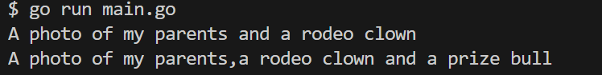

# Automated Testing
## contents you will get from this article
1. What is ***Automated Testing***
2. How to use ***Automated Testing***
3. What is Table-driven tests and how to use it to make you testing program effively
## What is Automated testing?
* An automated test is a seperate program that executes components of your main program,and verifies they behave as expected.

Example:suppose we have a function named JoinWithCommas(),which take a slice of strings and return a combined string.  
When we send ```[]string{"apple","orange"}```to it,we hope we can get "apple and orange",however when we send ```[]string{"apple","orange","banana"}``` to it,we hope we can get "apple,orange and banana"

```go
JoinWithCommas({"apple","orange"})=="apple and orange"
JoinWithCommas({"apple","orange","banana"})=="apple,orange and banana"
```
> As you can see ,before write and run the program,we have predict the returned values of the program.
## Let's begin to learn automated testing in the way of fixing our JoinWithComms function:
```go
func JoinWithCommas(phrases []string) string {
	result := strings.Join(phrases[:len(phrases)-1], ",")
    result += ", and "
	result += phrases[len(phrases)-1]
	return result
}
```
Look at the first version of our JoinWithCommas function,when we run it in the main func:
```go
func main(){
    phrases:=[]string{"my parents","a rodeo clown"}
    fmt.Println("A photo of",prose.JoinWithCommas(phrases))
    phrases:=[]string{"my parents","a rodeo clown","a prize bull"}
}
```
![The result of the program][def]

[def]: https://github.com/HitZhouzhou/HeadFirstGo/blob/main/chapter14_automated_test/test_prose/piture/result1.png
Look at the result above it have a mistake,as it mean that parents are a redeo clown and a prize bull,that must be an error.
### Let's fix it now
```go
func JoinWithCommas(phrases []string) string {
	result := strings.Join(phrases[:len(phrases)-1], ",")
	result += " ,and "
	result += phrases[len(phrases)-1]
	return result
}
```
We simply add and "," at the last string but that cause another error.

### So how can we make sure that every time we fix our program it won't cause another error?

#### Let's look at the test
"join_test.go"
```go
func TestTwoElements(t *testing.T)  {
	list := []string{"apple", "orange"}
	if JoinWithCommas(list) != "apple and orange" {
		t.Error("did't match expected value")
	}
}
```
> - The join part of the filename is not important ,but the _test.go part is;the go test tool looks for files named with that suffix.
> - Function name should begin with "Test"
> - Function should be passed a pointer to a testing.T value.

#### Running tests with the "go test"command

We can run the tests in this way.